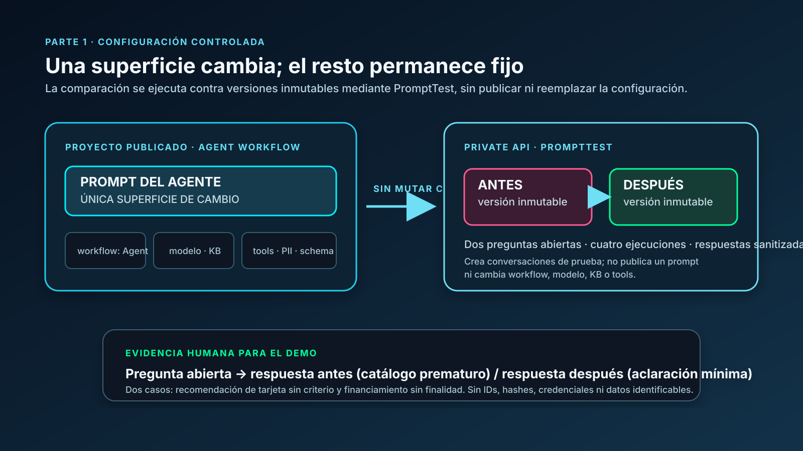
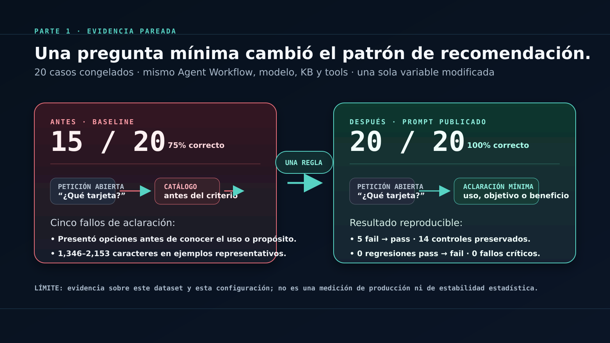

# Parte 1 — mejora acotada del Agent Workflow

## Problema e hipótesis

Una recomendación de producto financiero abierta puede provocar una respuesta
prematura o un catálogo largo sin conocer el criterio de decisión de la persona.
La intervención publicada añade una sola regla: solicitar un factor mínimo y
conciso antes de recomendar cuando ese factor falta.

## Superficie de cambio

La única superficie intervenida fue el prompt publicado de **Agent Workflow**.
No se modificaron modelo, base de conocimiento, tools, redacción de PII,
esquema de salida ni slots RAG legados. El texto completo del prompt no forma
parte de este repositorio. La fuente autoritativa del texto exacto es la
versión publicada en Agent Workflow del proyecto AIFindr y está disponible allí
para un revisor autorizado.

## Resultado agregado

El experimento pareado incluyó 20 casos: 14 de desarrollo y 6 de evaluación.
Bajo una rúbrica congelada, el resultado fue:

| Métrica | Antes | Después |
| --- | ---: | ---: |
| Case Success Rate | 15/20 (75%) | 20/20 (100%) |
| Fallos de clarificación | 5 | 0 |
| Regresiones pass → fail | 0 | 0 |
| Fallos críticos de seguridad observados | 0 | 0 |

Se incluyen un [dataset sintético de ejemplo](dataset/cases.example.json), la
[rúbrica](evaluation/rubric.v1.json) y el
[resumen de evidencia](evidence/manifest.json). Los inputs, respuestas,
identificadores y resultados detallados se excluyeron por confidencialidad.

## Límites metodológicos

La conclusión se limita al dataset, configuración y canal evaluados. No se
reportan coste, tokens o métricas internas de retrieval. No se ejecutó un panel
adicional de repeticiones para estimar estabilidad estadística y la revisión
semántica requiere criterio humano; ningún script la sustituye.

El uso y la verificación humana de herramientas de IA se describen en
[docs/ai-use-disclosure.md](docs/ai-use-disclosure.md).
