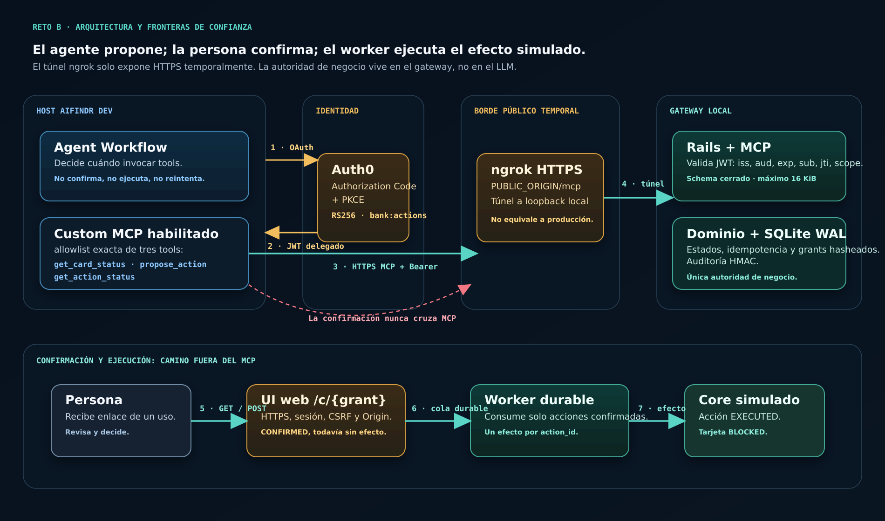
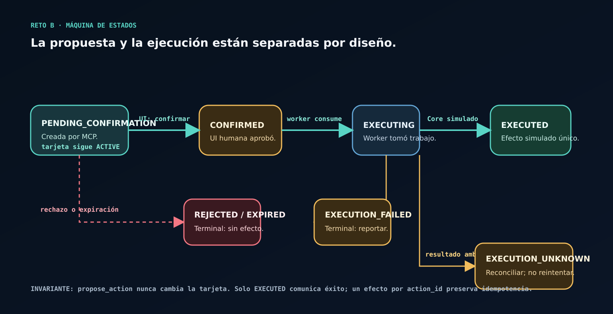

# Arquitectura implementada — Gateway MCP Reto B

## Alcance

Gateway público MCP para una única identidad y tarjeta sintéticas. Permite leer `card_demo`, proponer `CARD_BLOCK` y consultar una acción. El LLM no puede confirmar ni ejecutar. La confirmación ocurre en una UI web separada y el efecto lo aplica un worker durable sobre SQLite.

## Diagrama end-to-end

El recorrido integrado observado es deliberadamente distinto del recorrido de confirmación:

1. AIFindr inicia OAuth contra Auth0 y obtiene un JWT delegado RS256 con `bank:actions`.
2. AIFindr abre Streamable HTTP contra `PUBLIC_ORIGIN/mcp`, expuesto temporalmente por ngrok hacia el listener local del gateway.
3. El gateway valida el JWT y permite solo las tres tools registradas. `propose_action` persiste `PENDING_CONFIRMATION`; no bloquea la tarjeta.
4. La URL opaca de un solo uso lleva a la UI web por el mismo origen HTTPS temporal. Ahí se crea la sesión, se valida CSRF/Origin y la persona decide.
5. Solo una decisión humana válida persiste `CONFIRMED`. El worker consume esa fila durablemente y aplica el efecto simulado una vez, llevando la acción a `EXECUTED` y la tarjeta a `BLOCKED`.

ngrok transporta HTTPS hacia loopback para la prueba y no participa en autenticación, autorización, estados ni auditoría. Si cambia el origen temporal, cambian `PUBLIC_ORIGIN`, la audience de Auth0, la configuración MCP del Hub y la conexión OAuth; por eso no representa un despliegue productivo.

## Componentes

| Componente | Responsabilidad | Límite de confianza |
| --- | --- | --- |
| AIFindr Agent Workflow | Decide cuándo invocar tres tools permitidas y presenta resultados | No autoriza confirmación ni ejecución |
| Auth0 | Emite JWT RS256 delegado con audience exacta y `bank:actions` | Gateway valida localmente todos los claims requeridos |
| Streamable HTTP MCP | Inicialización, catálogo y llamadas autenticadas | Solo `/mcp`; máximo 16 KiB; host/origen permitidos |
| `Gateway::Domain` | Invariantes, transacciones, estados, idempotencia y auditoría | Única autoridad determinista de negocio |
| UI de confirmación | Canje de grant de un uso, sesión, CSRF y decisión humana | Posesión del enlace no equivale a identidad bancaria |
| Worker | Consume filas `CONFIRMED`, aplica el Core simulado y reconcilia | No recibe instrucciones del LLM |
| SQLite WAL | Tarjeta, acciones, intentos, efectos y cadena de auditoría | Adecuado para la demo de un nodo, no para réplicas productivas |
| ngrok | HTTPS temporal hacia loopback | Inspección desactivada; no equivale a hosting productivo |

## Invariantes

- Catálogo y allowlist: exactamente `get_card_status`, `propose_action`, `get_action_status`.
- `propose_action` nunca confirma ni cambia la tarjeta.
- Solo una acción activa; grant opaco de un uso almacenado como hash.
- La confirmación exige sesión de acción, token CSRF, HTTPS, Host exacto y origen verificable.
- `CONFIRMED` y el evento de auditoría se confirman en la misma transacción; el worker ejecuta después.
- Un efecto por `action_id`; reinicio o respuesta ambigua no autoriza ejecución duplicada.
- Solo `EXECUTED` significa éxito. `EXECUTION_UNKNOWN` exige reconciliación.
- Logs y errores omiten bearer tokens, cookies, grants y rutas de capacidades.

## Máquina de estados

La separación `PENDING_CONFIRMATION` → `CONFIRMED` → `EXECUTING` → `EXECUTED` evita que la llamada MCP produzca un efecto. Los estados `REJECTED`, `EXPIRED` y `EXECUTION_FAILED` son terminales. `EXECUTION_UNKNOWN` requiere reconciliación antes de cualquier decisión posterior.

## Decisiones verificadas en integración

Chromium con `Referrer-Policy: no-referrer` produjo `Origin: null`; se usa `strict-origin`, que revela solo el origen HTTPS y permite comparación exacta sin exponer la ruta. Rails/Puma puede dejar `rack.input` al final; el adaptador lo rebobina antes de una lectura limitada a 4097 bytes. Ambos casos tienen regresiones automatizadas.

## Límites

Principal fijo, Core simulado, SQLite, snapshot JWKS cargado al arrancar y túnel temporal. No hay multi-tenant, identidad bancaria real, rotación JWKS automática, alta disponibilidad ni despliegue productivo demostrado.
